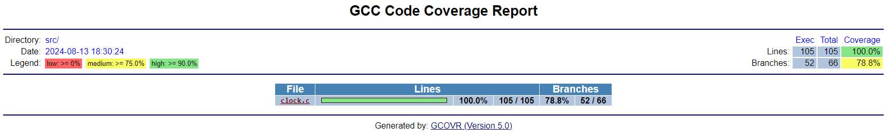

## Testing de Embebidos con Ceedling
Esta aplicación se desarrolló en el marco del curso dictado en el Simposio de Sistemas Embebidos de edición 2024 (SASE2024).

El objetivo del curso fue realizar pruebas automatizadas para validar requerimientos de una aplicación específica. Para poder hacer esto posible, es necesario contar con una PC con Linux y alguna distribución que el usuario prefiera. 
En el caso de contar con Windows, lo ideal es instalar WSL (Windows Subsystem for Linux).

En mi caso contaba con Windows, por ende para instalar WSL es simplemente ejecutar una línea de código en powershell:


    wsl --install

Luego para realizar la compilación del proyecto:

    sudo apt-get install build-essential
    sudo apt-get install ruby3.0
    sudo apt-get install gcovr

Para poder instalar el framework de pruebas automatizadas se utilizó Ceedling, cuya instalación se realiza ejecutando el comando siguiente:

    sudo gem install ceedling

# Windows Subsystem for Linux (WSL)

## ¿Qué es WSL?

Windows Subsystem for Linux (WSL) es una característica de Windows 10 y Windows 11 que permite a los usuarios ejecutar un entorno Linux directamente en Windows, sin la necesidad de una máquina virtual o arranque dual. Con WSL, es posible utilizar herramientas y utilidades de línea de comandos de Linux junto con aplicaciones de Windows, facilitando el desarrollo de software en un entorno híbrido.

## ¿Cómo Funciona WSL?

WSL actúa como una capa de compatibilidad que permite que los binarios ejecutables de Linux (en formato ELF) se ejecuten en Windows. Esto se logra a través de una interfaz proporcionada por el kernel de Windows que permite a las distribuciones de Linux ejecutarse como si fueran nativas.

### Componentes Clave de WSL:

1. **Kernel de Linux en Windows**: 
   - WSL 2 incluye un kernel de Linux real ejecutándose en un entorno liviano de máquina virtual (VM) utilizando la tecnología de hipervisor de Windows.
   - WSL 1, en cambio, traduce llamadas del kernel de Linux en llamadas equivalentes del kernel de Windows.

2. **Distribuciones de Linux**:
   - Es posible instalar varias distribuciones de Linux desde la Microsoft Store, como Ubuntu, Debian, Fedora, y otras. Cada distribución se ejecuta en su propio entorno de usuario, aislado de otras distribuciones y aplicaciones de Windows.

3. **Integración con Windows**:
   - Los archivos del sistema Linux se pueden acceder desde Windows a través de la ruta `\\wsl$\<DistroName>\`.
   - Los archivos del sistema de Windows son accesibles desde WSL bajo `/mnt/c/`, `/mnt/d/`, etc.
   - Se encuentra habilitada la ejecución de comandos de Linux desde la terminal de Windows y viceversa.

4. **Compatibilidad con Herramientas de Desarrollo**:
   - Es posible usar herramientas de desarrollo de Linux como `gcc`, `gdb`, `make`, `bash`, y más directamente en tu entorno WSL.
   - VSCode y otras IDEs ofrecen soporte integrado para WSL, permitiendo editar, compilar y depurar código en Linux desde Windows.

### Ventajas de WSL

- **Ligero**: No requiere los recursos que normalmente consumiría una máquina virtual completa.
- **Velocidad**: WSL 2 tiene un rendimiento significativamente mejorado gracias al uso de un kernel Linux real.
- **Conveniencia**: Te permite combinar las aplicaciones y herramientas que necesitas de ambos entornos, Linux y Windows, sin tener que reiniciar o cambiar de entorno.

### ¿Cómo Instalar WSL?

**A través de powershell**:
   
    wsl --install

    wsl --install -d <NombreDistribucion>


## WSL y Visual Studio Code

### ¿Qué es la Extensión WSL para VSCode?

La extensión **WSL** para [Visual Studio Code](https://code.visualstudio.com/) permite una integración directa entre el editor y el entorno Linux proporcionado por WSL. Con esta extensión, puedes abrir una distribución de Linux como una carpeta de proyecto en VSCode, editar archivos directamente desde el entorno Linux, y ejecutar comandos de Linux en la terminal integrada.

### Funcionalidades Principales

1. **Acceso a Archivos del Sistema Linux**:
   - Edita archivos directamente en tu entorno WSL como si estuvieras trabajando en un sistema Linux nativo. VSCode puede acceder a todos los archivos de tu distribución Linux instalada en WSL.

2. **Terminal Integrada**:
   - Usa la terminal de Linux dentro de VSCode, ejecutando comandos de Linux directamente en el entorno de WSL.

3. **Soporte para Extensiones de Linux**:
   - Las extensiones que instales en VSCode pueden ejecutarse en el contexto de Linux, lo que es especialmente útil para herramientas de desarrollo específicas de Linux.

4. **Depuración**:
   - Depura aplicaciones en tu entorno WSL usando GDB u otros depuradores compatibles, todo desde la interfaz de VSCode.

### Instalación de la Extensión WSL para VSCode

1. **Instalar la Extensión WSL**:
   - Abre VSCode, ve a la pestaña de Extensiones (o usa `Ctrl+Shift+X`), y busca "WSL".
   - Instala la extensión "WSL - Remote" de Microsoft.

2. **Abrir un Proyecto en WSL**:
   - Después de instalar la extensión, puedes abrir cualquier carpeta dentro de tu distribución WSL directamente desde VSCode. Ve a la paleta de comandos (`Ctrl+Shift+P`), escribe `WSL: Open Folder` y selecciona la carpeta deseada.

3. **Configurar Entorno de Desarrollo**:
   - Una vez que tengas la extensión instalada y tu proyecto abierto en WSL, puedes configurar la depuración, ejecutar tareas de construcción, y trabajar como si estuvieras en un entorno Linux nativo.

### Ejemplo de Configuración con WSL (c_cpp_properties.json)

Para poder realizar la configuración y debuggear un problema en el código se proporciona el archivo .json de configuración de ejemplo para esta aplicación en específico. 

```json
{
    "version": "0.2.0",
    "configurations": [
        {
            "name": "GDB Debugging",
            "type": "cppdbg",
            "request": "launch",
            "program": "${workspaceFolder}/build/test/out/test_reloj.out", // Ruta al archivo ejecutable
            "args": [], // Argumentos para el programa
            "stopAtEntry": false,
            "cwd": "${workspaceFolder}", // Directorio de trabajo
            "environment": [],
            "externalConsole": false,
            "MIMode": "gdb", // Usa GDB como depurador
            "setupCommands": [
                {
                    "description": "Enable pretty-printing for gdb",
                    "text": "-enable-pretty-printing",
                    "ignoreFailures": true
                }
            ],
            //"preLaunchTask": "build", // Tarea de compilación antes de depurar
            "miDebuggerPath": "/usr/bin/gdb", // Ruta a gdb, asegurarse de que esté instalado
            "logging": {
                "moduleLoad": false,
                "trace": true,
                "engineLogging": false,
                "programOutput": true,
                "exceptions": true
            },
            "launchCompleteCommand": "exec-run",
            "internalConsoleOptions": "openOnSessionStart"
        }
    ]
}
```

### intelliSenseMode

De manera que se pueda acceder a los archivos de **"unity.h"** para poder acceder a las declaraciones del framework agregarlo en la lista de paths a incluir como en el siguiente ejemplo:

```json
{
    "configurations": [
        {
            "name": "Win32",
            "includePath": [
                "${workspaceFolder}/**",
                "/var/lib/gems/3.0.0/gems/ceedling-0.31.1/vendor/unity/src/**"
            ],
            "defines": [
                "_DEBUG",
                "UNICODE",
                "_UNICODE"
            ],
            "windowsSdkVersion": "10.0.22621.0",
            "compilerPath": "cl.exe",
            "cStandard": "c17",
            "cppStandard": "c++17",
            "intelliSenseMode": "${default}"
        }
    ],
    "version": 4
}
```

## Resultados

Los resultados obtenidos fueron los siguientes:

### Ceedling
    Test 'test_reloj.c'
    -------------------
    Compiling test_reloj_runner.c...
    Compiling test_reloj.c...
    Compiling unity.c...
    Compiling clock.c...
    Compiling cmock.c...
    Linking test_reloj.out...
    Running test_reloj.out...

    --------------------
    OVERALL TEST SUMMARY
    --------------------
    TESTED:  8
    PASSED:  8
    FAILED:  0
    IGNORED: 0


### Test de covertura

    mtinduarte@MSI:/mnt/c/Users/Martin/Desktop/GitHub_MtinDuarte/sase-tdd$ ceedling clobber gcov:all utils:gcov

    Clobbering all generated files...
    (For large projects, this task may take a long time to complete)


    Test 'test_reloj.c'
    -------------------
    Generating runner for test_reloj.c...
    Compiling test_reloj_runner.c...
    Compiling test_reloj.c...
    Compiling unity.c...
    Compiling clock.c with coverage...
    Compiling cmock.c...
    Linking test_reloj.out...
    Running test_reloj.out...
    Creating gcov results report(s) in 'build/artifacts/gcov'... Done in 0.887 seconds.

    --------------------------
    GCOV: OVERALL TEST SUMMARY
    --------------------------
    TESTED:  8
    PASSED:  8
    FAILED:  0
    IGNORED: 0


    ---------------------------
    GCOV: CODE COVERAGE SUMMARY
    ---------------------------
    clock.c Lines executed:100.00% of 105
    clock.c Branches executed:100.00% of 66
    clock.c Taken at least once:78.79% of 66
    clock.c Calls executed:100.00% of 6
    clock.c Lines executed:100.00% of 105


